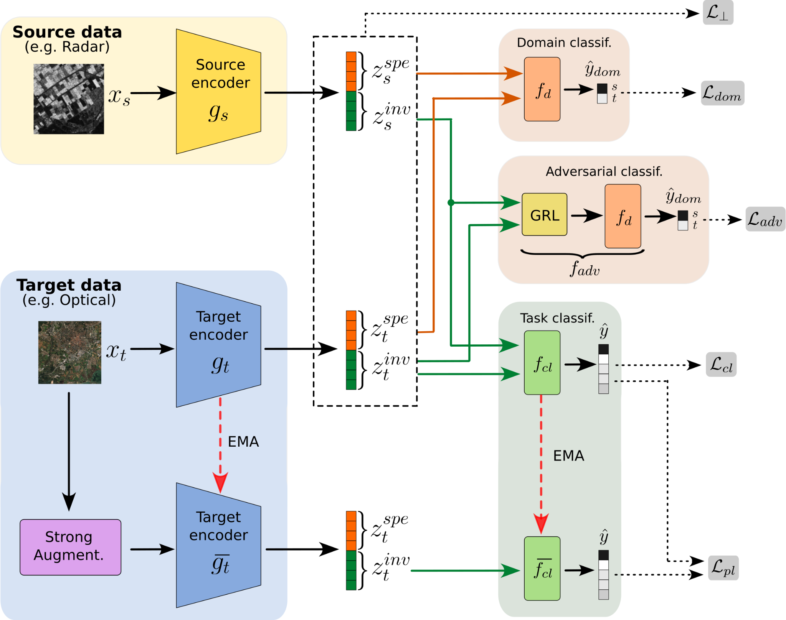

# Adversarial Feature Disentanglement for Semi-Supervised Heterogeneous Domain Adaptation

## Framework overview 

**Considered setting:** Semi-supervised domain adaptation methods aim to generalize from a labeled source domain to a scarcely labeled target domain, despite potential distribution shifts. This challenge becomes even more complex when the source and target data differ in modality representation, such as when acquired using sensors with varying characteristics. In remote sensing, for example, data may differ in acquisition modes (e.g., optical vs. radar), spectral properties (e.g., RGB vs. multispectral), or spatial resolution. This scenario, known as Semi-Supervised Heterogeneous Domain Adaptation (SSHDA), introduces additional challenges due to the heightened distribution shift caused by modality heterogeneity.

**Proposed approach:** This work builds upon SHeDD (Semi-supervised Heterogeneous Domain Adaptation via Disentanglement), a recently proposed method for SSHDA, adapting it to address a more challenging scenario where the target domain has extremely limited labeled data. By introducing a novel adversarial module to compel the domain-invariance of features and incorporating a mean teacher approach to improve pseudo-labeling, the enhanced framework demonstrates robust and stable performances.

## Code organization

Train and test of the proposed framework are performed in file `main.py`.

### Data
To prepare the data for use with our framework, first download the original datasets and normalize them according to your application requirements. Once preprocessed, place the dataset (including both modality files and the label file) in a folder named ./Datasets/EUROSAT-MS-SAR.

Finally, run `preproc.py` to generate the necessary training data files.

### Input arguments 
Scripts take the following input arguments (they are used for data loading configuration and may be modified to meet your own dataset conventions):
1) **Dataset Name**: Default is *EUROSAT-MS-SAR*.  
2) **Source Data Prefix**: Specifies the modality used as the source domain. Options include *MS* or *SAR*. The remaining modality is automatically assigned as the target domain.  
3) **GPU Number**: Specify the GPU to use.  
4) **Labeled Target Samples**: Define the number of labeled target samples (e.g., 5, 10, 25, 50) or provide multiple values (default value is the array [5, 10, 25, 50]).  
5) **Split Number**: Choose a specific train-test split (e.g., 0, 1, 2, 3, 4) or select multiple splits (default value is the array [1, 2, 3, 4, 5]).

Example of running istruction:

<!---->

    python main.py -d EUROSAT-MS-SAR -s MS -n_gpu 0 -ns 5 10 50 -np 1 2 5

We maintained a dictionary structure in `param.py` to enable users to easily add additional multimodal datasets for classification tasks.
